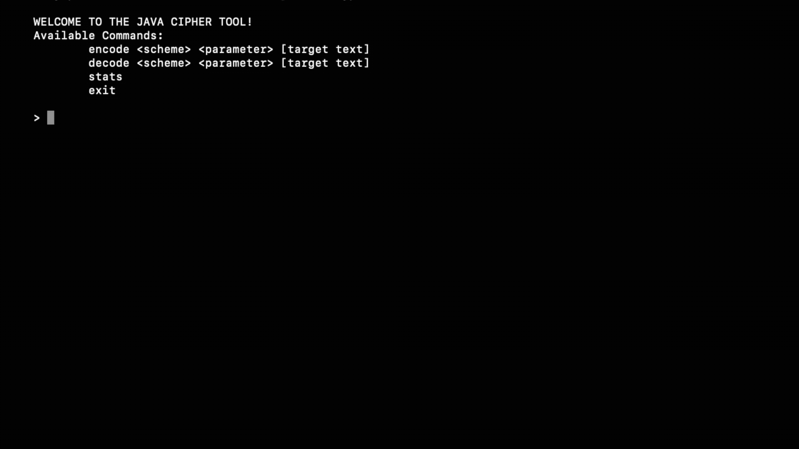

# java-cipher-tool
Java command-line tool for encrypting and decrypting text with multiple schemes.
---

## 🎥 Demo

## 🛠️ Tech Stack
**Language:** Java

**Interface:** Command-Line Interface (CLI)

**Concepts:** Cryptography, Algorithms

## ✨ Features
- Supports encoding and decoding for 3 encryption schemes: base-n, Caesar shift, and block rotation
- Tracks scheme usage and validates user input
- Interactive CLI with persistent previous input handling

## 🔮 Future Improvements
- Add support for file input/output for bulk encryption/decryption
- Implement additional encryption schemes
